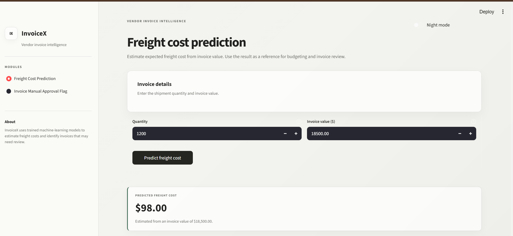
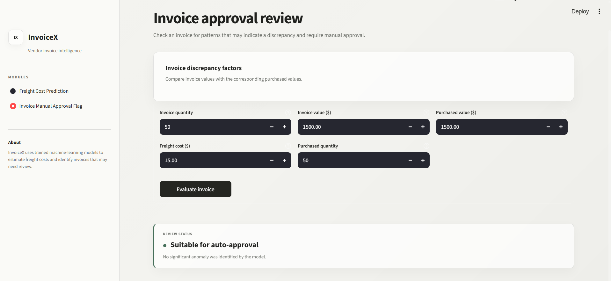
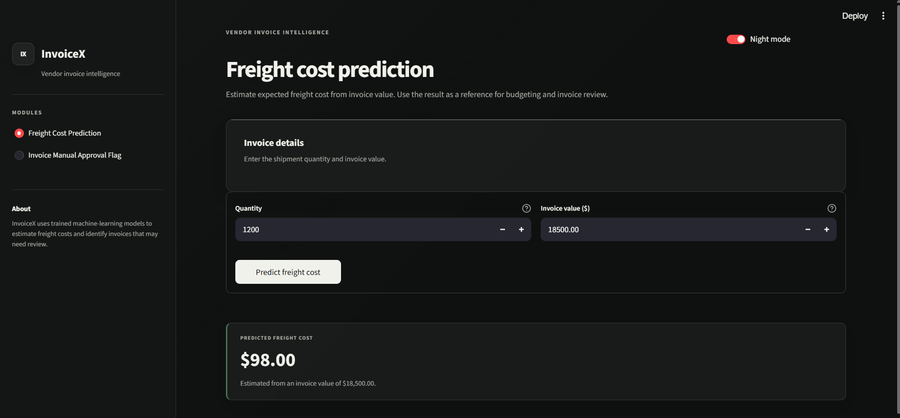

# InvoX

**Vendor Invoice Intelligence System**  
**Freight Cost Prediction & Invoice Risk Flagging**

## Demo

Here is a quick look at the InvoX Vendor Invoice Intelligence Portal:







## Table of Contents

- [Project Overview](#project-overview)
- [Business Objectives](#business-objectives)
- [Data Sources](#data-sources)
- [Models Used](#models-used)
- [Application](#application)
- [Project Structure](#project-structure)
- [How to Run This Project](#how-to-run-this-project)

---

## Project Overview

**InvoX** is an end-to-end machine learning system designed to assist finance and procurement teams in analyzing vendor invoices.

The system focuses on two major tasks:

1. **Predicting expected freight cost** for vendor invoices.
2. **Flagging potentially risky invoices** that may require further manual review.

By combining machine learning with an interactive web application, InvoX helps reduce repetitive invoice analysis and supports faster financial decision-making.

---

## Business Objectives

- **Improved Cost Forecasting**  
  Predict expected freight costs using invoice and purchase-related information.

- **Invoice Risk Detection**  
  Identify potentially abnormal invoices based on differences between invoice and purchase information.

- **Faster Invoice Review**  
  Reduce repetitive manual checks and help finance teams focus on invoices that require further investigation.

- **Data-Driven Decision Making**  
  Provide machine learning based insights through a simple and interactive interface.

---

## Data Sources

The project uses an internal SQLite database named `inventory.db`.

The database contains vendor invoice and purchase-related information used for both prediction and invoice risk analysis.

Key information includes:

- Invoice quantity
- Invoice dollar amount
- Freight cost
- Purchase quantity
- Purchase dollar amount
- Purchase and invoice dates
- Receiving information
- Historical purchase information

The data is processed and transformed into features suitable for machine learning models.

---

## Models Used

### 1. Freight Cost Prediction

A regression-based machine learning model is used to estimate the expected freight cost of an invoice.

The model uses invoice and purchase-related features to learn the relationship between the available input variables and freight cost.

The trained model is stored as a serialized `.pkl` file and loaded during application inference.

---

### 2. Invoice Risk Flagging

A **Random Forest Classifier** is used to identify invoices that may require manual review.

The model considers invoice and purchase-related features such as:

- `invoice_quantity`
- `invoice_dollars`
- `Freight`
- `total_item_quantity`
- `total_item_dollars`

The invoice flagging pipeline includes data preprocessing, model training, evaluation, and model serialization.

---

## Application

InvoX provides an interactive web application built using **Streamlit**.

The application provides a simple interface for users to:

- Enter invoice information.
- Predict expected freight costs.
- Assess invoices for potential risk.
- View model-generated results through an easy-to-use dashboard.

The interface is designed to be clean, minimal, and easy to use for users who may not have a technical or machine learning background.

---

## Project Structure

```text
InvoiceX/
│
├── 📂 freight_cost_prediction/
│   └── 📂 models/                  # Trained freight prediction model files
│
├── 📂 images/                      # Application demo screenshots
│
├── 📂 inference/                   # Model inference and prediction scripts
│
├── 📂 invoice_flagging/            # Invoice risk classification pipeline
│
├── 📂 models/                      # Stored trained model artifacts
│
├── 📂 notebooks/                   # Jupyter notebooks for analysis
│
├── 📜 app.py                       # Main Streamlit web application
├── 📜 requirements.txt             # Python dependencies
├── 📜 .gitignore                   # Git ignored files
└── 📜 README.md                    # Project documentation
```

## How to Run This Project

### 1. Clone the Repository

```bash
git clone https://github.com/Poojaaa-del/InvoiceX.git
cd InvoiceX
```

### 2. Create a Virtual Environment

```bash
python -m venv .venv
```

##### Activate the virtual environment on Windows:

```bash
.venv\Scripts\activate
```

### 3. Install Dependencies

##### Install all required libraries:

```bash
pip install -r requirements.txt
```

### 4. Train the Models

##### To train the freight cost prediction model:

```bash
python freight_cost_prediction/train.py
```

##### To train the invoice risk classification model:

```bash
python invoice_flagging/train.py
```

The trained models will be saved in the project's models/ directories.

### 5. Run the Application

##### Start the Streamlit application:

```bash
python -m streamlit run app.py
```

After starting the application, open the following URL in your browser:

http://localhost:8501

### 6. Using the Application

Once the application is running:

1. Enter the required invoice details.
2. Use **Freight Cost Prediction** to estimate the expected freight cost.
3. Use **Invoice Risk Flagging** to check whether an invoice should be reviewed.
4. Review the predictions and risk assessment displayed by the application.

---

## Workflow

```text
Vendor Invoice & Purchase Data
              │
              ▼
       Data Preprocessing
              │
       ┌──────┴──────┐
       ▼             ▼
Freight Prediction  Invoice Risk Flagging
    Regression         Random Forest
       │                 │
       ▼                 ▼
Expected Freight    Risk Assessment
       │                 │
       └──────┬──────────┘
              ▼
        Streamlit App
              │
              ▼
         User Results
```

---

## Project Goal

The goal of **InvoX** is to simplify vendor invoice analysis using machine learning.

The system combines **freight cost prediction** and **invoice risk flagging** to help reduce repetitive manual checks, identify potentially abnormal invoices, and support faster financial decision-making.

---

## Author

**Pooja Kumari**

GitHub: [Poojaaa-del](https://github.com/Poojaaa-del)
